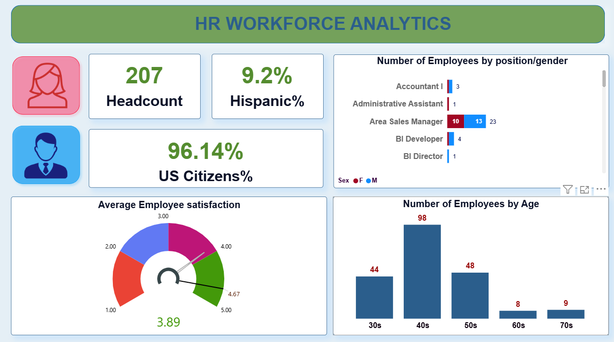
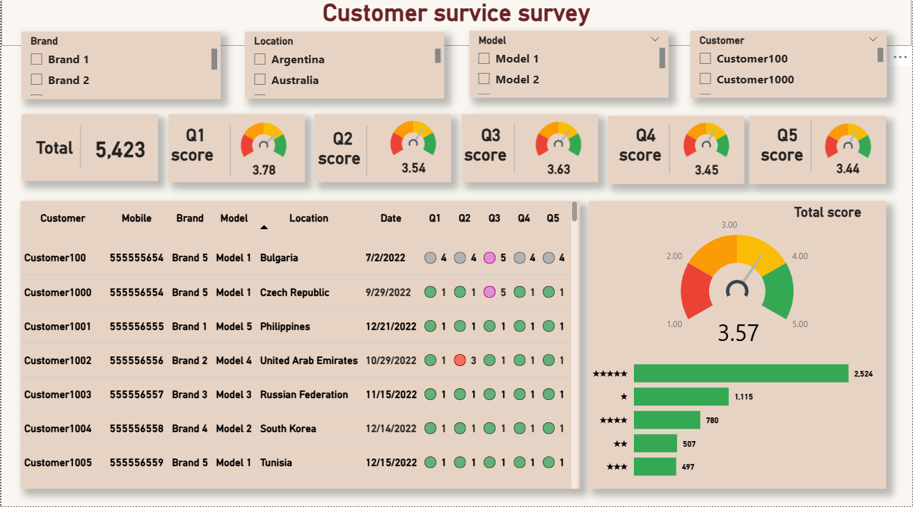
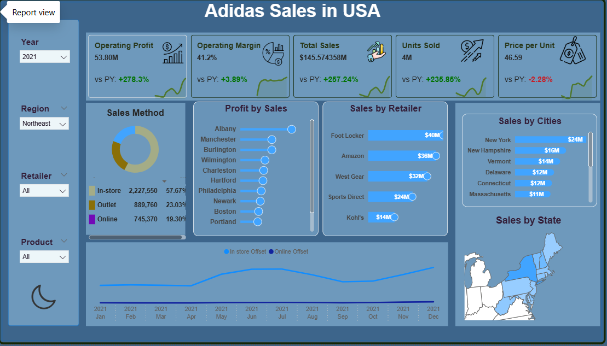
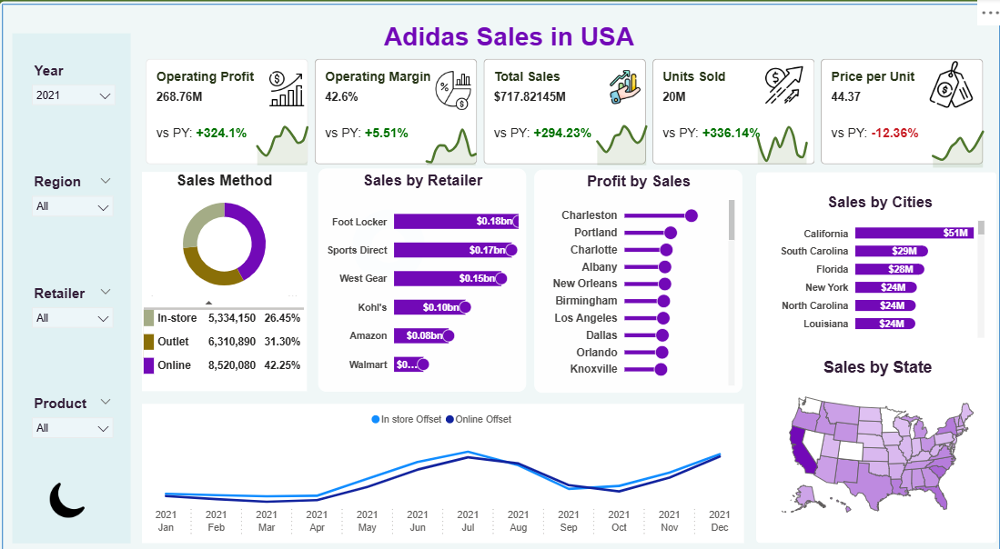
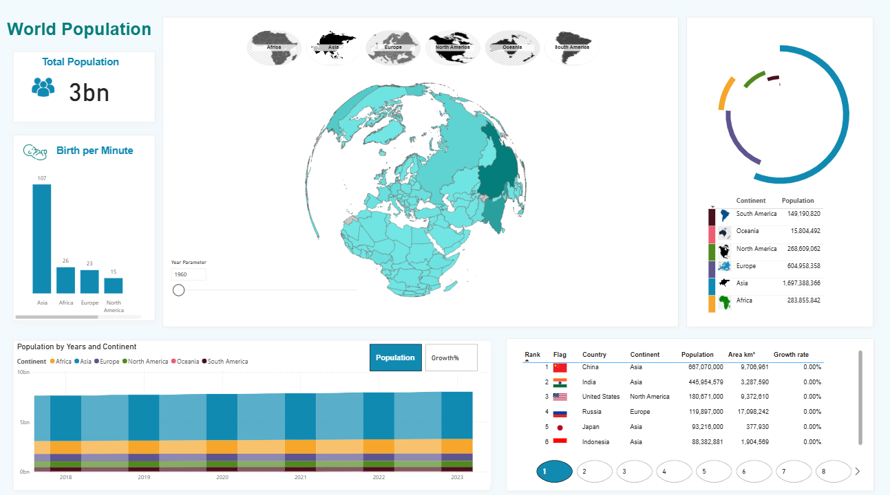
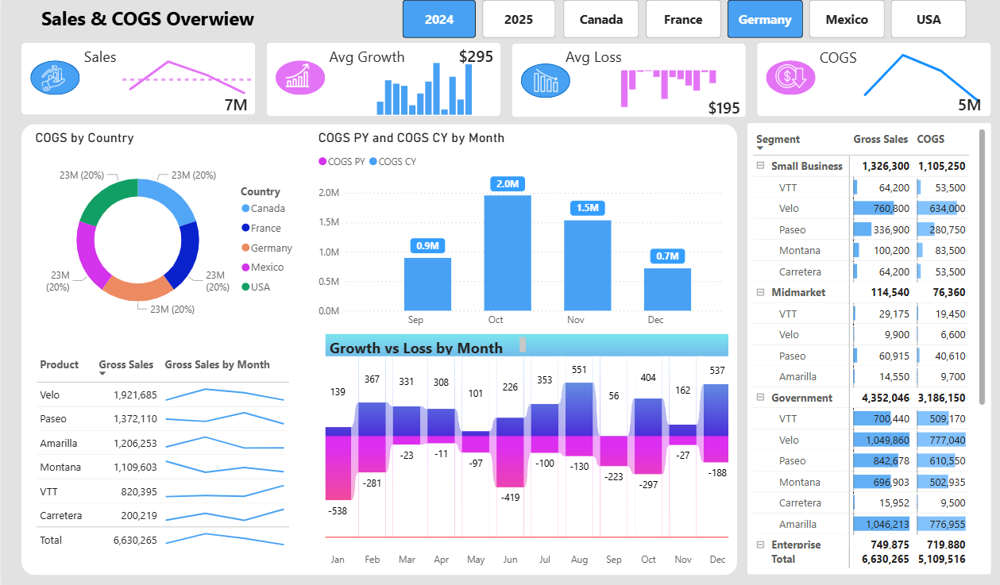
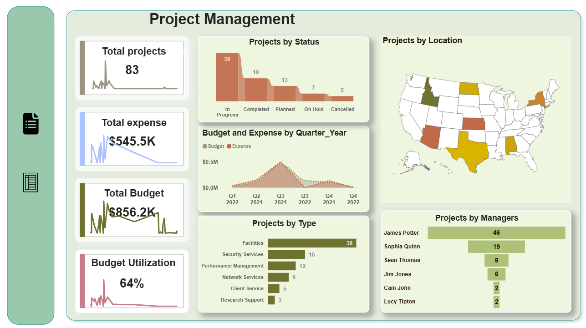

# Data Analytics Portfolio
### Fatima Ismayilova

Data Analyst specializing in HR and business analytics with experience in building interactive dashboards using **Power BI, Excel, and SQL**.

This repository contains a collection of **Power BI dashboard projects** developed as part of my data analytics learning journey.

---

# Tools & Technologies

- Power BI
- Excel
- SQL
- Data Visualization
- Dashboard Development
- Data Analysis

---

# Projects

## HR Workforce Analytics

HR analytics dashboard analyzing workforce metrics including employee headcount, demographics, and employee satisfaction indicators.

---

## Customer Service Survey Dashboard

Customer analytics dashboard evaluating satisfaction survey responses across brands, locations, and product models.

---

## Adidas Sales Dashboard

Sales analytics dashboard analyzing revenue, operating profit, sales distribution, and retailer performance across regions.

Dark version:

Light version:

---

## World Population Dashboard

Interactive data visualization dashboard exploring global population distribution across countries and continents.

---

## Sales & COGS Overview

Business analytics dashboard analyzing sales performance and cost of goods sold across countries and product segments.

---

## Project Management Dashboard

Operational analytics dashboard tracking project status, budgets, expenses, and project distribution across managers and locations.

---

# Note

Some dashboards were developed by following Power BI tutorial videos and training exercises.  
These projects are included to demonstrate my skills in **data analysis, dashboard development, and data visualization**.

---

# Contact

Email: ismayilovafatime0@gmail.com

LinkedIn:  
https://www.linkedin.com/in/fatimaismayilova
